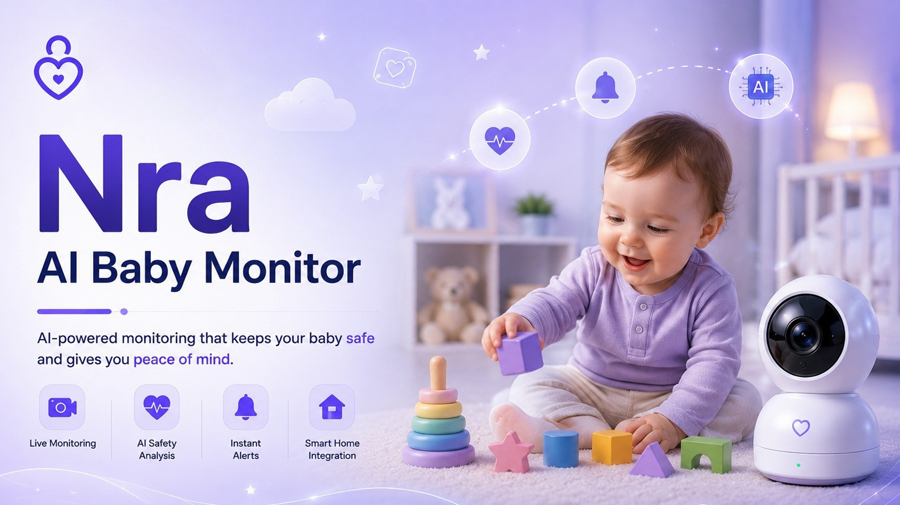

# 👶 Nra AI Baby Monitor

AI-powered baby monitoring system designed to enhance child safety through intelligent monitoring, behavior analysis, and instant parent notifications.

---
## 👤 Project Type

**Individual Project**

This project was independently designed and developed as part of an AI Bootcamp challenge.

---
  
## 🌐 Live Demo

(Add GitHub Pages link here)

---

## 📸 Preview

---

## 📖 Overview

Nra AI Baby Monitor is an intelligent monitoring system that combines Artificial Intelligence and Computer Vision to continuously monitor a child, detect dangerous situations, analyze behavior, and notify parents in real time.

The project focuses on creating a safer home environment by providing smart monitoring, automated alerts, and activity reporting.

---

## ✨ Features

- 📹 Live Monitoring
- 🤖 AI Behavior Analysis
- ⚠️ Danger Detection
- 🔔 Instant Parent Alerts
- 🏠 Smart Home Integration
- 📊 Activity Reports

---

## 🛠️ Technologies

- HTML5
- CSS3
- JavaScript

---

## 🚀 Future Improvements

- Live camera streaming
- AI emotion recognition
- Cry detection
- Sleep analysis
- Mobile application
- Cloud database
- AI-powered health recommendations

---

## 👩‍💻 Author

**Reman Hussam Ghawanni**

Artificial Intelligence Student

Taibah University
